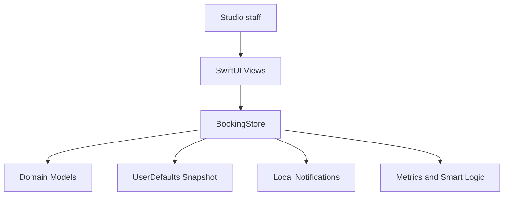
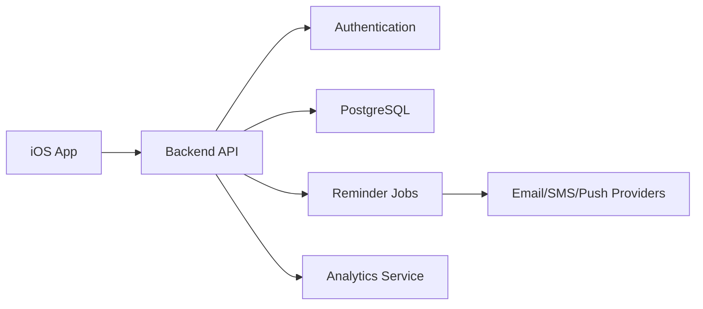

# Architecture

## Overview

HairBooking Studio Pro is currently implemented as a local-first iOS application. The app uses SwiftUI for the interface and a central observable store for application state, persistence and domain operations.



## Main Components

### SwiftUI Views

`ContentView.swift` contains the app flow and feature screens:

- login
- onboarding
- dashboard
- weekly calendar
- booking form
- client registry
- editable service catalog
- editable staff management
- smart desk
- reports
- studio settings

`SharedViews.swift` contains reusable cards, rows, badges, theme colors and formatting helpers used across the feature screens.

The UI observes `BookingStore` through `@EnvironmentObject`.

### Domain Models

`Models.swift` defines the main business entities:

- `Client`
- `Service`
- `StaffMember`
- `Booking`
- `AvailabilityDay`
- `ClientReference`
- `StudioSettings`
- `SmartInsight`
- `SuggestedSlot`

The models are value types and support serialization through `Codable`.

### Application Store

`BookingStore.swift` is responsible for:

- storing app state
- loading and saving snapshots
- creating and updating bookings
- detecting scheduling conflicts
- computing dashboard metrics
- generating suggested slots
- managing local notifications
- exporting JSON backups

## Booking Conflict Detection

Each booking has a start date and an end date derived from the service duration. A new booking conflicts with an existing one when:

- the professional is the same
- the existing booking is not cancelled
- the new interval overlaps the existing interval

```text
newStart < existingEnd && newEnd > existingStart
```

## Suggested Slot Generation

Suggested slots are generated from:

- selected service duration
- selected professional or all available professionals
- weekday availability rule
- working hours
- break interval
- existing bookings

The current prototype scans candidate times in 30-minute steps and returns the first valid options.

## Decision Support Logic

The Smart desk includes two explainable analytics features:

- **No-show risk score:** upcoming bookings are scored with deterministic rules based on confirmation status, deposit, cancellation history, service duration and evening time slots.
- **Demand segmentation:** active bookings are grouped into morning, afternoon and evening segments, then summarized by booking count and revenue.
- **Service performance:** non-cancelled bookings are grouped by service to show booking count and generated revenue.
- **Workload forecast:** scheduled bookings for the next seven days are aggregated into expected revenue, appointment count, booked minutes and capacity utilization based on staff availability.
- **Client follow-up:** clients without recent completed or confirmed bookings are surfaced in the Smart desk with direct communication actions.

This rule-based approach is intentionally transparent for the thesis prototype. In a production evolution, the same inputs can become features for a predictive model trained on historical booking outcomes.

## Persistence Strategy

The local prototype stores a full `Snapshot` in `UserDefaults`. The snapshot includes services, clients, staff, bookings, references, availability rules, settings and onboarding state.

For production, the same snapshot boundary can evolve into:

- REST API payloads
- database tables
- sync conflict resolution records
- offline cache entries

## Future Backend Architecture



## Quality Strategy

Current quality practices:

- Swift type checking during local development
- GitHub Actions workflow for iOS build verification
- Form-level validation for booking payments and staff/service compatibility

Recommended next steps:

- Unit tests for conflict detection
- Unit tests for suggested slot generation
- UI tests for booking creation
- Snapshot tests for major screens
